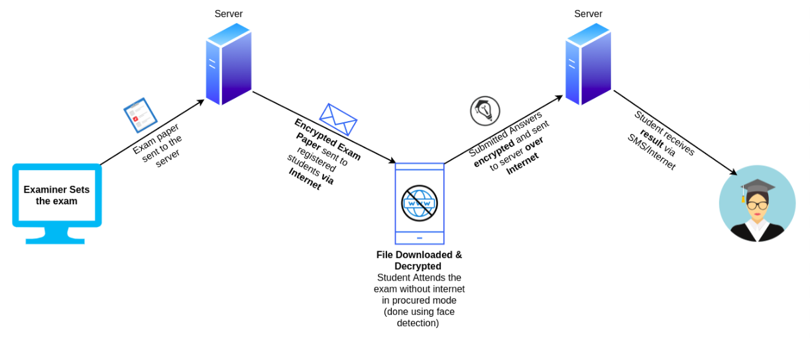

### LeoCode

<h1 align="center">
  Offline Exam Portal
</h1>
<h3 align="center"> 
A intituitive web app which allows students to attend the exam in completely offline environment.
</h3>


## Table of Contents

- <a href="#confused-problem-statement">Problem Statement</a>
- <a href="#bulb-solution-proposed">Solution Proposed</a>
- <a href="#sparkles-advantages">Advantages</a>
- <a href="#cloud-deployment-instructions">Deployment Instructions</a>
- <a href="#computer-tech-stack">Tech Stack</a>
- <a href="#-team-members">Team Members</a>

## :confused: Problem Statement

Amid this coronavirus pandemic, all the education systems have switched to the online mode of examination, but many students live in areas that have a shaky internet connection. They have to travel a few kilometers to just attend the exam. Sometimes, even if students have a solid internet connection the college server is not simply capable of handling the load of thousands of students which also results in inconvenience for students. To solve such problems, we have built a intuitive web app that will allow students to attempt the exam in the complete offline mode.

## :bulb: Solution Proposed

The Admin / Examiner / Appropriate Authority will have the option to set the paper with flexible format (Time limit, number of questions, etc) on a web app. Then a download option will be available to each student. Now, whenever a student requests to download the exam paper, an encrypted file will be sent to the end-user. This file will be encrypted using the AES algorithm and the key will be a combination of some of the exam data and some randomly generated numbers. Once the exam paper is downloaded there is no need for an internet connection to attend the exam. Just before the exam time, a msg that contains part of the key will be sent to the student using SMS which will be termed as exam password. This exam password and some of the exam data will act as keys and will decrypt the downloaded file at the start of exam. Now the student will be able to attend the exam in completely offline mode and will also be monitored during this time using functionalities like facial recognition, tab switching, etc. The answers given by the student will be saved in secured and encrypted format and whenever the user gets an internet connection, then his/her answers along with the results / report of facial recognition, tab switching, etc, will be sent to the server, and depending on that student will receive his grades.

<p style="padding: 20px;">

 </p>

## :sparkles: Advantages

- Will even work in rural areas / areas with low internet / zero internet bandwidth.
- Help in reducing the load on college server.
- Security (as paper format will be encrypted and decrypted on individual devices).
- Password of exam / Decryption key will be sent to each candidate over SMS as soon as admin creates an exam.
- Facial and Tab Switching status of each candidate along final report of answers will be attached to answer sheet (offline) and sent to admin in presence of internet connectivity.
- Candidate will be monitored the whole time during exam.
- Admin will have extra privilege to set questions at individual level (as unique key will be associated with each candidate for decryption).
- Exams at your home comfort.

## :cloud: Deployment Instructions

- **Prerequisites**:

  - Ubuntu 18.04 > Server
  - Nginx: [Installation instructions](https://www.digitalocean.com/community/tutorials/how-to-install-nginx-on-ubuntu-18-04)
  - MongoDB: [Installation instruction](https://docs.mongodb.com/manual/tutorial/install-mongodb-on-ubuntu/)
  - Node.js & npm: [Installation instructions](https://www.digitalocean.com/community/tutorials/how-to-install-node-js-on-ubuntu-18-04)

- Clone the Project:\
  `git clone https://github.com/chaudharirohit2810/Hacked.git`

- Navigate to root project directory:\
  `cd Hacked`

### Backend

- Install Dependencies required for backend:\
  `cd backend && npm install`
- Install Pm2:\
  `sudo npm install pm2@latest -g`
- Start the backend server:\
  `pm2 start index.js --name hacked_backend`
- Save PM2 Process list and corresponding environments:\
  `pm2 save`
- Navigate to nginx conf file:\
  `cd /etc/nginx/sites-enabled`
- Open default file as a root:\
  `sudo vim default`
- Copy following configuration in server block of default file:

  ```
  location /api/ {
      proxy_pass http://localhost:5000/;
      proxy_set_header Upgrade $http_upgrade;
      proxy_set_header Connection 'upgrade'
      proxy_set_header Host $host;
      proxy_cache_bypass $http_upgrade;
  }
  ```

### Frontend:

- Install Dependencies required for backend (cd into root project folder):\
  `npm install`
- Open the config.js file in src folder:\
  `cd src && vim config.js`
- Change the backendURL to the url of Backend which is:\
  `http://<ip_address>/api`
- Navigate to client folder:\
  `cd ..`
- Build the react project:\
  `npm run build`\
  This will create a build folder in client directory. The app is ready to be deployed!
- Navigate to nginx conf file:\
  `cd /etc/nginx/sites-enabled`
- Open default file as a root:\
  `sudo vim default`
- Copy following configuration in server block of default file:

  ```
    root <path_to_build_folder>;

    index index.html index.htm;

    location / {
            try_files $uri $uri/ /index.html;
    }
  ```

## :computer: Tech Stack

- MERN Stack
  - MongoDB
  - Express
  - React.js
  - Node
- Progressive Web application
- Material UI

## 👦🏽 Team Members:

- [Rohit Chaudhari](https://github.com/chaudharirohit2810)
- [Viraj Jadhav](https://github.com/VirajJadhav)
- [Prajwal Adsul](https://github.com/PrajwalAdsul)
